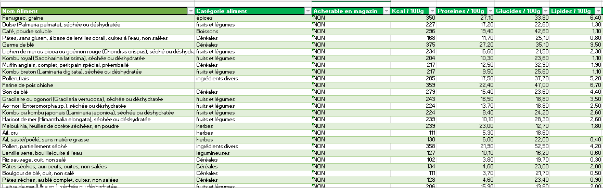
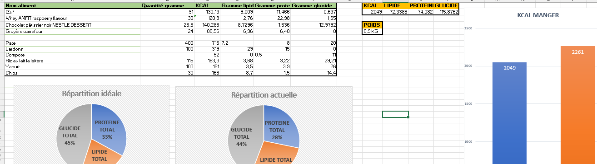
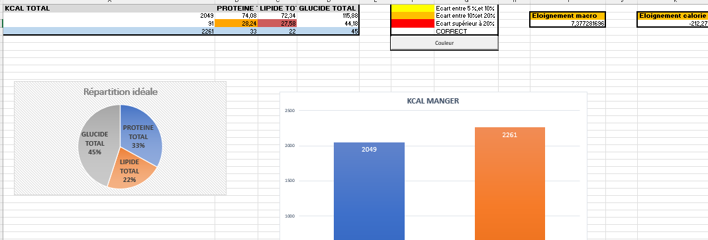
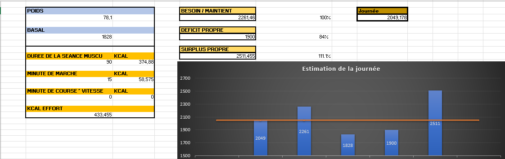

# Nutriwise

**Nutriwise** est une application dashboard développée sur **Excel** pour le **suivi et l’analyse des repas quotidiens**, avec génération de **conseils nutritionnels personnalisés** à l’aide de l’**intelligence artificielle**.

Les données nutritionnelles ont étés récupérées via une **API open source** et intégrées au système à l’aide d’un **processus ETL**.

---

## Aperçu du Dashboard

Base de données, triable en fonction des aliments conseillés pour finir la journée
  

= = =

Alimentation de la journée

= = =

Statistique et conseil
  

= = =

Suivi calorique

